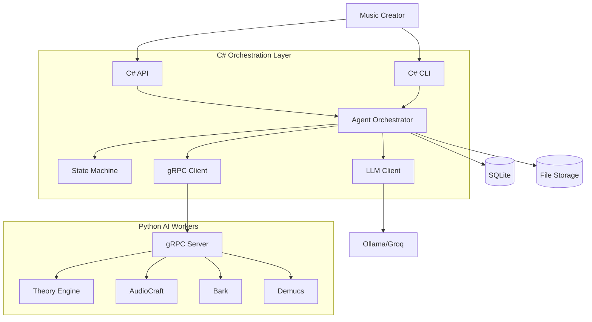
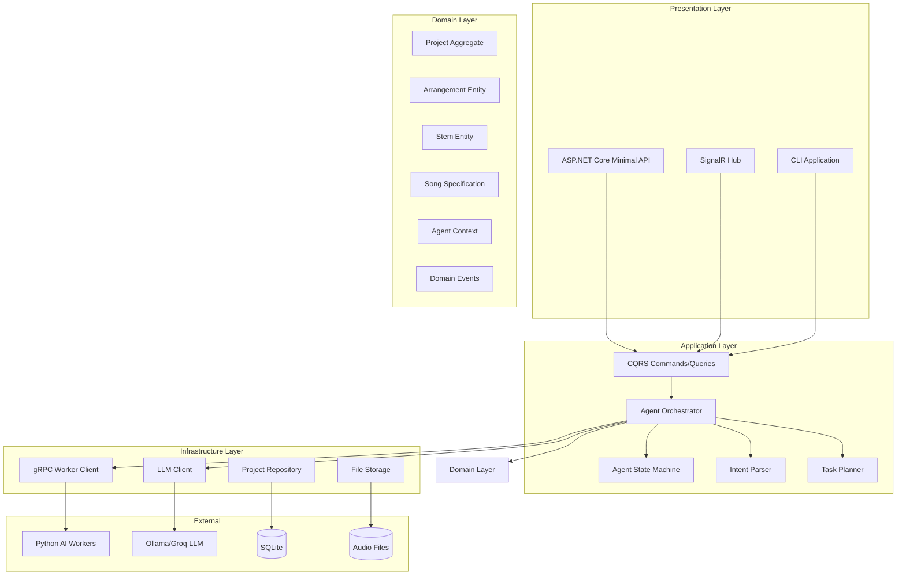
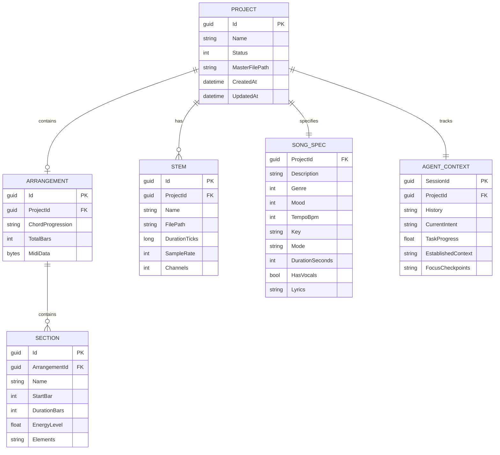

# MusicForge AI

> LLM-orchestrated music production platform transforming natural language into professional, stems-separated, commercially-licensable audio tracks

---

## Executive Summary

**One-Liner**: AI-powered music production that generates complete tracks from text prompts with stem separation and iterative refinement.

**Target Users**: Content creators, indie game developers, YouTubers, podcasters who need custom, royalty-free music.

**Core Value Proposition**: Professional-quality music generation without musical expertise or licensing concerns.

**Project Type**: Hybrid Application (C# .NET 9 API + Python AI Workers + CLI)

---

## System Context

### Users and Actors

| Actor | Role | Interaction Method |
|-------|------|-------------------|
| Music Creator | Primary user | CLI/API/Web interface |
| LLM Orchestrator | AI agent | Internal service |
| Python Workers | AI inference | gRPC |
| External LLM | Intent parsing, planning | REST API (Ollama/Groq) |

### System Boundaries



---

## Architecture Overview

### Component Diagram



### Technology Stack

| Layer | Technology | Version | Justification |
|-------|-----------|---------|---------------|
| **C# Orchestration** | | | |
| Framework | .NET 9 | 9.0 | Latest LTS, performance, async excellence |
| API | ASP.NET Core Minimal API | 9.0 | Lightweight, fast, type-safe |
| Real-time | SignalR | 9.0 | WebSocket abstraction for progress |
| ORM | EF Core (SQLite) | 9.0 | Local-first, embedded database |
| gRPC | Grpc.Net.Client | 2.x | Type-safe, streaming, performant |
| CQRS | MediatR | 12.x | Clean command/query separation |
| CLI | System.CommandLine | 2.x | First-party, Typer-like |
| **Python Workers** | | | |
| Runtime | Python | 3.11+ | AI library compatibility |
| gRPC | grpcio | 1.60+ | Service communication |
| Audio Gen | AudioCraft | 1.3+ | Meta's MusicGen model |
| Vocals | Bark | 0.1+ | Suno's voice synthesis |
| Theory | music21 | 9.1+ | Music theory and MIDI |
| Mixing | Pedalboard | 0.9+ | Audio effects (Spotify) |
| Stems | Demucs | 4.0+ | Source separation |
| **Deployment** | | | |
| Containers | Docker | 24+ | Isolation, GPU support |
| Orchestration | Docker Compose | 2.x | Multi-service management |

---

## Key Architectural Decisions

### Decision Log

| # | Decision | Options Considered | Choice Made | Rationale | Trade-offs |
|---|----------|-------------------|-------------|-----------|------------|
| 1 | Orchestration Language | Python, C#, TypeScript | **C#** | 20y expertise, strong typing, performance | Python ML ecosystem not native |
| 2 | AI Communication | REST, gRPC, Message Queue | **gRPC** | Streaming, typed contracts, performance | More complex than REST |
| 3 | Architecture | Monolith, Microservices | **Clean Architecture Hybrid** | Separation of concerns, testable | Initial complexity |
| 4 | Database | PostgreSQL, SQLite, LiteDB | **SQLite** | Local-first, embedded, EF Core support | Not for high concurrency |
| 5 | Real-time Updates | Polling, WebSocket, SSE | **SignalR** | Abstraction, fallback support, .NET native | Client complexity |
| 6 | LLM Integration | Direct API, LangChain | **Direct Client** | Control, no bloat, familiar patterns | Manual retry/caching |

### Design Patterns Used

- **Clean Architecture**: Dependency inversion, domain at center
- **CQRS**: Commands and queries separated via MediatR
- **State Machine**: Explicit agent state transitions
- **Repository**: Abstract data access
- **Domain Events**: Loose coupling for side effects
- **Factory**: Entity creation with validation

---

## Data Architecture

### Entity Relationship Diagram



### Data Flow

```
1. User Input → Intent Parser (LLM) → ParsedIntent
2. ParsedIntent → Task Planner → ExecutionPlan
3. ExecutionPlan → Agent Orchestrator → State Transitions
4. Per State → Python Worker (gRPC) → Audio/MIDI/Stems
5. Results → Domain Entities → Repository → SQLite
6. Progress → SignalR Hub → Client Updates
```

---

## Security Considerations

### API Security
- Rate limiting on public endpoints
- Input validation via FluentValidation
- Parameterized database queries (EF Core)
- File path sanitization for audio storage

### Resource Protection
- GPU memory limits per request
- Request timeout enforcement
- Disk quota for generated files
- Graceful degradation without GPU

### Data Privacy
- All processing local (no cloud AI by default)
- User audio files stored locally only
- No telemetry without explicit consent

---

## API Design

### REST Endpoints

| Method | Endpoint | Description | Auth |
|--------|----------|-------------|------|
| POST | /api/v1/projects | Create new project | No |
| GET | /api/v1/projects | List all projects | No |
| GET | /api/v1/projects/{id} | Get project details | No |
| POST | /api/v1/projects/{id}/generate | Start generation | No |
| POST | /api/v1/projects/{id}/iterate | Iterate with feedback | No |
| POST | /api/v1/projects/{id}/export | Export project | No |
| GET | /api/v1/projects/{id}/stems | Get project stems | No |
| GET | /api/v1/health | Health check | No |

### SignalR Hub

```csharp
// Client subscribes to project
await hubConnection.InvokeAsync("SubscribeToProject", projectId);

// Server pushes events
OnProgress(projectId, component, progress, message)
OnStemComplete(projectId, stemName, filePath)
OnComplete(projectId, masterFilePath)
OnError(projectId, errorMessage)
```

---

## Performance Requirements

### Target Metrics

| Metric | Target | Notes |
|--------|--------|-------|
| 30s track generation | < 5 minutes | With GPU |
| API response time | < 100ms | Non-generation endpoints |
| Memory (C# API) | < 256MB | Idle state |
| Memory (Python Worker) | < 4GB | Model loaded |
| GPU VRAM | 8GB minimum | MusicGen medium |

### Optimization Strategies

- **Streaming**: Generate audio in chunks, stream via gRPC
- **Caching**: Cache LLM responses for similar prompts
- **Lazy Loading**: Load models on first request
- **Parallel Processing**: Generate stems concurrently where possible

---

## Deployment Architecture

### Environments

| Environment | Purpose | Configuration |
|-------------|---------|---------------|
| Development | Local dev | docker-compose.dev.yml |
| Production | Local deploy | docker-compose.yml |

### Container Architecture

```yaml
services:
  api:        # C# .NET 9 API + SignalR
  worker:     # Python AI Worker (GPU)
  ollama:     # Local LLM (optional)
```

---

## Development Roadmap

### Phase 1: Foundation (Current)
- [x] Project architecture design
- [ ] C# solution structure
- [ ] Domain layer implementation
- [ ] Application layer skeleton

### Phase 2: Core Pipeline
- [ ] gRPC communication
- [ ] Python worker basics
- [ ] Theory generation
- [ ] Audio synthesis

### Phase 3: Production Features
- [ ] Vocal synthesis
- [ ] Stem separation
- [ ] Mixing/mastering
- [ ] CLI interface

### Phase 4: Polish
- [ ] Docker deployment
- [ ] Integration tests
- [ ] Documentation
- [ ] Performance optimization

---

## Success Criteria

✅ `dotnet run --project src/MusicForge.Cli -- create "chill lofi beat"` produces audio  
✅ API generates music with streaming progress  
✅ Python worker responds to gRPC health checks  
✅ Context preserved across iterations (AgentContext.FocusCheckpoints populated)  
✅ All tests pass (>80% coverage)  
✅ Docker Compose starts all services correctly

---

## Open Questions & Risks

### Open Questions
1. Should we support cloud LLM providers (OpenAI, Anthropic) as fallback?
2. What's the maximum supported song duration?
3. Should stems be stored or regenerated on export?

### Known Risks

| Risk | Impact | Probability | Mitigation |
|------|--------|-------------|------------|
| GPU unavailable | High | Medium | CPU fallback (slower) |
| Model download failures | High | Low | Pre-cache in Docker |
| Python dependency conflicts | Medium | Medium | Locked requirements.txt |
| Audio quality inconsistency | Medium | Medium | Multiple generation passes |

---

**Last Updated**: 2026-01-13  
**Author**: Claude (Antigravity)  
**Version**: 1.0.0
