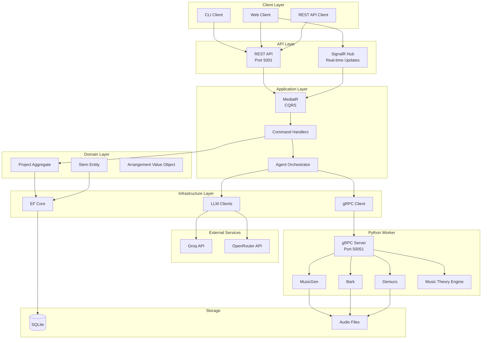
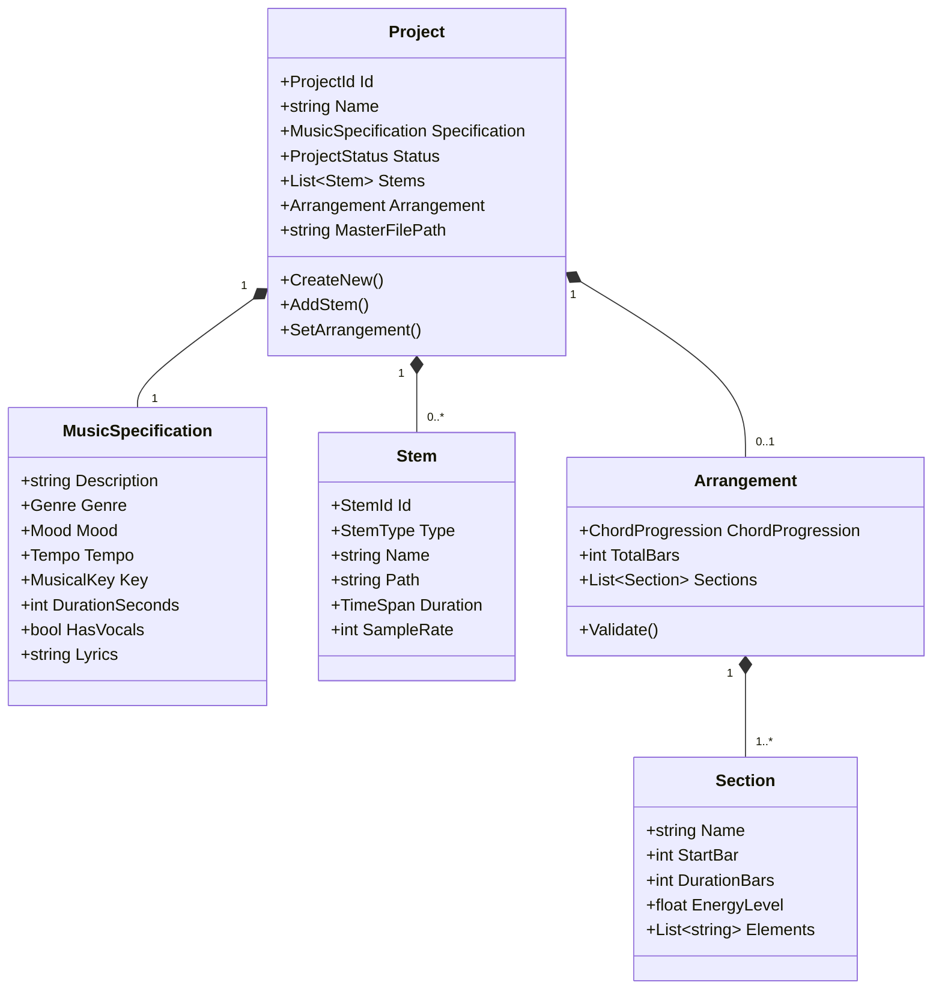
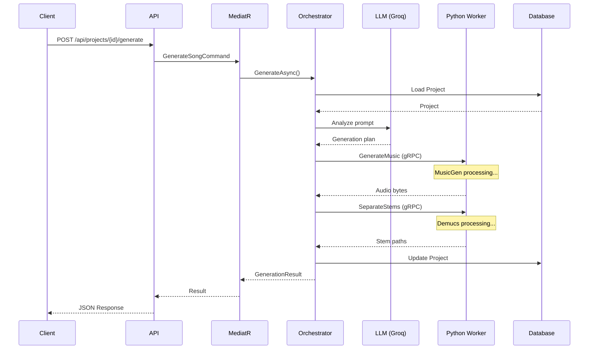
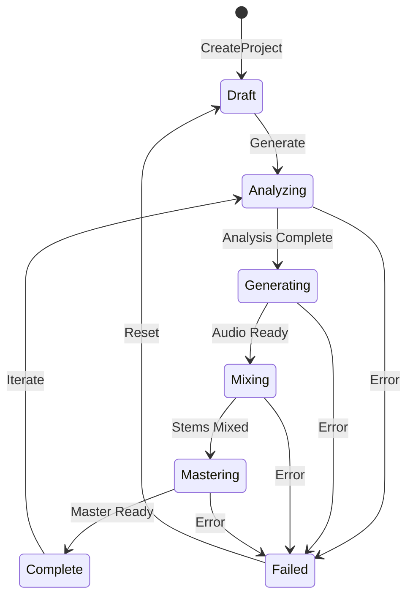
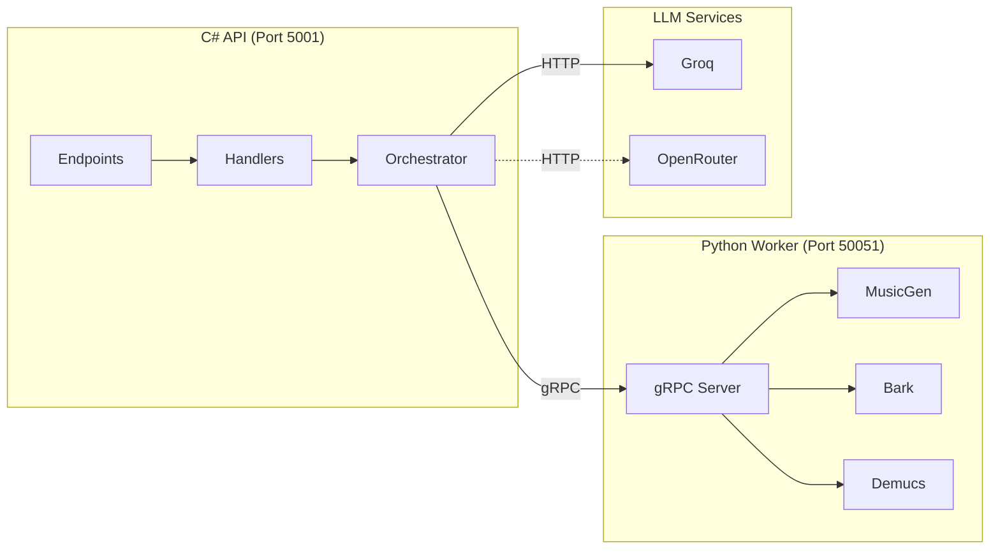
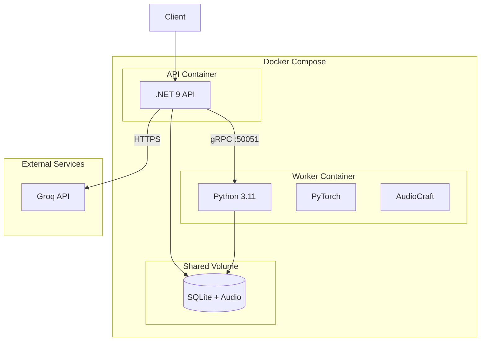

# Architecture Overview

This document provides detailed architecture documentation for MusicForge.

## System Architecture

## Domain Model

## Request Flow

## State Machine

## Component Interaction

## Deployment Architecture

## Technology Decisions

| Decision | Choice | Rationale |
|----------|--------|-----------|
| API Framework | .NET 9 Minimal API | Performance, simplicity, modern C# |
| Architecture | Clean Architecture | Separation of concerns, testability |
| CQRS | MediatR | Decoupled handlers, pipeline behaviors |
| Persistence | EF Core + SQLite | Lightweight, portable, no external DB |
| Communication | gRPC | Efficient binary protocol, streaming |
| Real-time | SignalR | Native .NET, WebSocket support |
| AI Runtime | Python | ML ecosystem, PyTorch compatibility |
| Containerization | Docker Compose | Multi-service orchestration |

## Security Considerations

1. **API Keys**: Environment variables, never in code
2. **gRPC**: Internal network only, not exposed
3. **Database**: File-level permissions
4. **Audio Files**: Path validation, sandboxed directories
